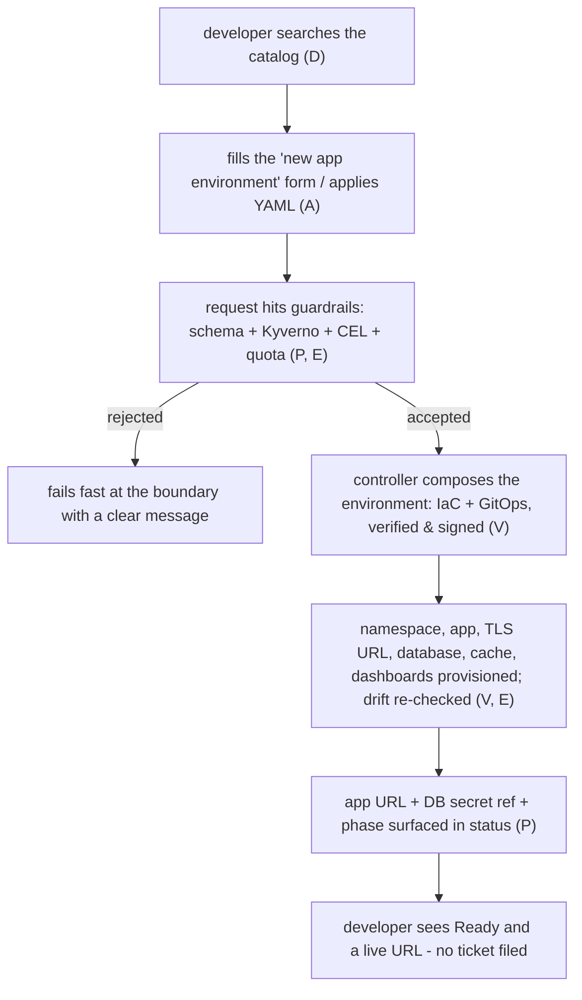

<!-- @generated by scripts/sync-content.mjs from platform-eng/building-a-platform.md — edit the source, not this file -->

A platform is not a product you install; it is a road you pave so other teams can move without asking permission. The **PAVED** framework names the five courses of that road:

- **P** - Predictable contracts
- **A** - Accessible interfaces
- **V** - Verified deployment paths
- **E** - Enabling guardrails
- **D** - Discoverable catalog

PAVED is the mnemonic. The *build* order is different, because a road is poured from the ground up: you lay the base before the surface, and you put the barriers up before you open the on-ramps. This doc constructs a platform one layer at a time in dependency order, names concrete tools for each, and carries a single example all the way up the stack: a self-service **Application Environment** - a developer asks for "a production-ready environment for my service" and gets a namespace, a running app with autoscaling, a URL with TLS, a database, a cache, secrets, dashboards, and delivery wiring, as one request. Notice what that example is *not*: a lone database. A raw Postgres instance is a low-level primitive that ends up hidden inside this composition as one leaf among many. The capability worth exposing is the whole environment.

For the operating-model argument behind all of this (why federation, why a control plane), see [From Ticket Queue to Federated Product](/blog/platform-engineering). For a concrete tool that implements most of these layers at once, see [Kratix: Platform APIs as Kubernetes-Native Promises](/blog/kratix).

## The stack at a glance

```
        ┌──────────────────────────────────────────────┐
   D    │  Discoverable catalog   (signage + the map)  │   find it, know who owns it
        ├──────────────────────────────────────────────┤
   A    │  Accessible interfaces  (surface + on-ramps) │   how a human/system asks
        ├──────────────────────────────────────────────┤
   E    │  Enabling guardrails    (shoulders + rails)  │   makes self-service safe
        ├──────────────────────────────────────────────┤
   V    │  Verified deployment    (binder course)      │   turns the ask into reality
        ├──────────────────────────────────────────────┤
   P    │  Predictable contracts  (base course)        │   what can be asked for
        ├──────────────────────────────────────────────┤
   0    │  Substrate / control plane (the roadbed)     │   the ground it all sits on
        └──────────────────────────────────────────────┘
```

| Letter | Course of the road | Build step | Answers |
|---|---|---|---|
| (Layer 0) | Roadbed / subgrade | 0. Foundation | What does everything run on? |
| P | Base course | 1. Contract | What can a developer ask for, and in what shape? |
| V | Binder course | 2. Fulfillment | How does the ask reliably become running reality? |
| E | Shoulders and rails | 3. Safety | What keeps a self-service request from doing harm? |
| A | Surface + on-ramps | 4. Access | How does a human or system actually make the ask? |
| D | Signage + map | 5. Discovery | How do they find it and know it exists? |

The order matters. You cannot pave an accessible surface (A) over a delivery path (V) that has no base contract (P), and you should not open the on-ramps (A) before the guardrails (E) are up. Build down-up, expose top-down.

---

## Layer 0 - The substrate (the roadbed)

**What it is.** The control plane every higher layer is expressed against: a declarative, level-triggered API that stores desired state and runs controllers to converge reality toward it. This is the ground; PAVED is what you lay on top.

**Why it is the foundation.** Every property the upper layers need - a uniform request surface, validation at one boundary, reconciliation, RBAC, watch/eventing - is a property of the control plane, not something each capability reinvents. Almost every platform toolchain builds on Kubernetes for exactly this reason, which is covered in depth in [From Ticket Queue to Federated Product](/blog/platform-engineering#the-substrate-platform-patterns-borrowed-from-the-kubernetes-core).

**Concrete choices.**

| Need | Options |
|---|---|
| The control plane | Kubernetes: managed (EKS, GKE, AKS) for production; kind / k3s / minikube for local |
| State backing | etcd (bundled), or the managed provider's equivalent |
| Multi-cluster reach | Cluster API, Karmada, or a GitOps hub-and-spoke |

You do not have to use Kubernetes. But if you choose something else, you are choosing to rebuild reconciliation, admission, and a typed API surface yourself. That is the bill this layer pays once so the other five do not.

**Example.** A cluster exists. Nothing application-specific yet - just the roadbed that the `AppEnvironment` type will be registered against.

---

## Layer 1 (P) - Predictable contracts (the base course)

**What it is.** A stable, typed, versioned definition of what a developer can request, decoupled from how it is fulfilled. The contract is the load-bearing layer: everything above rides on it, and it is the thing you promise not to break.

**Why it is first.** Federation only works if teams integrate against a boundary, not against each other's code. The contract is that boundary. Three properties make it strong enough to build on:

- **Declarative.** The request states the desired outcome (`tier: production`), never the procedure.
- **Schema-validated.** Malformed requests are rejected at submission, not deep inside a pipeline.
- **Opaque fulfillment.** The producer can rewrite the implementation freely as long as the schema holds.

This is the type-vs-behavior split from the Kubernetes core: **the type is the contract; the behavior comes later** (`../k8s/04-advanced-development/crds/crds.md`).

**Concrete tools.**

| Concern | Tools |
|---|---|
| Define the type | Kubernetes CRDs; Crossplane `CompositeResourceDefinition` (XRD); a Kratix Promise's `.spec.api` |
| Author the schema | OpenAPI v3 structural schemas; CEL rules (`x-kubernetes-validations`) for cross-field checks |
| Scaffold from Go types | Kubebuilder / Operator SDK (`+kubebuilder:validation:*` markers generate the schema) |
| Version and evolve | `spec.versions` + conversion webhooks; treat the schema with semantic-versioning discipline |

**Example.** Define an `AppEnvironment` type. The schema is deliberately high-level - it asks about the *service*, not the infrastructure:

```yaml
# the contract: what a developer may request, validated at the API boundary
openAPIV3Schema:
  type: object
  properties:
    spec:
      type: object
      properties:
        team:   { type: string }
        tier:   { type: string, enum: ["dev", "staging", "production"] }
        image:  { type: string }
        domain: { type: string }            # e.g. checkout.acme.io
        components:
          type: object
          properties:
            database: { type: string, enum: ["none", "postgres", "mysql"], default: "none" }
            cache:    { type: boolean, default: false }
        observability: { type: boolean, default: true }
      required: [team, tier, image]
```

Applying this (as a CRD, an XRD, or a Promise) makes `kubectl explain appenvironment.spec` work and rejects an unknown `tier` before any controller runs. Note that `database` is a single enum field here - the developer picks "postgres" and never sees storage sizing, versions, HA, or backups. All of that lives in the fulfillment layer, not the contract. There is still no behavior - the base course is poured, nothing drives on it yet.

---

## Layer 2 (V) - Verified deployment paths (the binder course)

**What it is.** The layer that turns an accepted request into running reality, and does so *reliably and observably* - reconciled continuously, tested before it ships, and traceable after. "Verified" is the operative word: an unverified delivery path is just a pipeline with good intentions.

**Why it sits here.** A contract with no fulfillment is inert typed storage. This layer binds the contract to real infrastructure. It has to be level-triggered (re-converging, not fire-and-forget) so that drift, partial failures, and Day-2 changes are handled by construction rather than by rerunning a pipeline ([From Ticket Queue to Federated Product](/blog/platform-engineering#why-a-live-api-beats-a-shift-left-check)).

**Concrete tools.**

| Stage | Tools |
|---|---|
| Reconcile the type | controller-runtime / Kubebuilder (Go), Kopf (Python); Crossplane Compositions + Providers; Kratix workflows |
| Wrap existing IaC | Terraform / OpenTofu, Pulumi, Helm, Ansible - run as pipeline steps or controllers |
| Deliver to clusters (GitOps) | Argo CD, Flux - the controller emits manifests, GitOps applies them |
| Progressive rollout | Argo Rollouts, Flagger (canary / blue-green with automated rollback) |
| Pipeline engine | Tekton, Argo Workflows (for multi-step, multi-team fulfillment) |
| Verify before ship | envtest, kuttl, Terratest (integration); conftest / policy unit tests |
| Verify the supply chain | cosign / Sigstore signing, SLSA provenance, SBOM generation |

**Example.** A controller now watches `AppEnvironment`. One request fans out into a whole environment, and the database is just one branch of it:

```
AppEnvironment "checkout" observed   (team: payments, tier: production)
  ├─ namespace + ResourceQuota + NetworkPolicy
  ├─ Deployment + HorizontalPodAutoscaler        (from spec.image)
  ├─ Ingress + cert-manager Certificate          → https://checkout.acme.io
  ├─ database: emit a PostgreSQL claim           → its own Promise/Composition sizes it, adds HA + backups
  ├─ cache: Redis                                (spec.components.cache)
  ├─ secrets: ExternalSecret                     ← Vault
  ├─ observability: Grafana dashboard + Prometheus alert rules
  └─ delivery: Argo CD Application + catalog entry
  verify:  envtest + kuttl ran in CI on this controller image (signed, SLSA-attested)
  status:  write app URL, DB secret ref, and phase into .status
  re-check: loop re-runs on drift, on spec change, on schedule
```

This is where "hidden behind a composition" becomes concrete: the developer never asked for RDS storage or a Postgres version. The environment controller emitted a lower-level `PostgreSQL` request on their behalf, and *that* capability (its own contract and controller, possibly a [nested Promise](/blog/kratix)) handles the sizing, HA, and backups. The developer runs `kubectl get appenvironment checkout`, sees `Ready`, and gets a URL plus a secret reference. The path from ask to reality is paved and, crucially, *tested* - the binder course is laid over the base.

---

## Layer 3 (E) - Enabling guardrails (the shoulders and rails)

**What it is.** The policy layer that makes self-service *safe*: what a request may and may not do, enforced uniformly at the boundary and at runtime. Guardrails are called "enabling" for a reason - they are what let you hand the keys to every team without hand-reviewing every request.

**Why before access, not after.** This is the load-bearing sequencing decision of the whole framework. If you open accessible self-service interfaces (Layer 4) before the guardrails exist, you have built an unlit highway with no barriers. Put the rails up first; then opening the on-ramps is safe rather than reckless. Guardrails wrap both the *request* (admission-time) and the *running result* (runtime).

**Concrete tools.**

| Guardrail | Tools |
|---|---|
| Admission policy (validate/mutate requests) | OPA Gatekeeper, Kyverno, CEL `ValidatingAdmissionPolicy` (in-tree, no webhook), custom admission webhooks (`../k8s/04-advanced-development/admission-webhooks/admission-webhooks.md`) |
| Baseline workload safety | Pod Security Admission; seccomp / AppArmor profiles |
| Blast-radius limits | RBAC (least privilege per team), `ResourceQuota`, `LimitRange`, `NetworkPolicy` |
| Secrets and identity | HashiCorp Vault, External Secrets Operator, SPIFFE/SPIRE, Workload Identity |
| Cost and drift | OpenCost / Kubecost (budgets), the reconciler itself for drift remediation |
| Supply-chain gate | Sigstore policy-controller, Kyverno image-verification rules |

The key property is that these live at the control plane, once, and cannot be bypassed by choosing a different pipeline - the difference between "shift-left" checks and control-plane policy explained in [From Ticket Queue to Federated Product](/blog/platform-engineering#5-guardrails-as-a-pluggable-pipeline-stage-not-scattered-code).

**Example.** Guardrails now wrap the `AppEnvironment` capability:

- A Kyverno policy rejects any `tier: production` environment whose `image` is tagged `:latest`, or that omits a `NetworkPolicy`.
- A CEL admission policy requires `spec.domain` to fall under an approved zone (`*.acme.io`) and requires `spec.team` to map to a known cost center.
- For production, the environment controller forces the database branch to HA-with-backups regardless of what the developer asked, and mints short-lived Vault credentials it rotates on a schedule.
- An OpenCost budget alert fires if a team's environments exceed their cost center's cap.

No developer had to know any of this exists. The road now has shoulders.

---

## Layer 4 (A) - Accessible interfaces (the surface and on-ramps)

**What it is.** The ways a human or system actually makes the request. The contract (P) defines *what* the ask is; this layer defines *how* you make it - and does so at whatever altitude the consumer works at, from raw API to a form in a portal.

**Why now.** The base, binder, and rails are in place, so it is safe to make the capability easy to reach. Accessibility means meeting developers where they are, usually more than one on-ramp onto the same paved road:

**Concrete tools.**

| On-ramp | Tools | For |
|---|---|---|
| Raw declarative API | `kubectl apply` a custom resource | Platform-native teams, automation |
| Golden-path templates | Backstage Software Templates, cruft / cookiecutter | Scaffolding a new service the right way |
| Workload spec | Score, Radius | Describe a workload once, run it anywhere |
| Self-service UI | Backstage, Port, an internal portal over the API | Developers who want a form, not YAML |
| CLI | A thin `platform` CLI wrapping the API | Terminal-first workflows |
| IaC module | A Terraform/Pulumi module that submits the request | Teams already living in IaC |

The rule: every on-ramp submits the *same* Layer 1 contract and is subject to the *same* Layer 3 guardrails. The interface is a facade over the contract, never a second, divergent path around it.

**Example.** The `AppEnvironment` capability gets three on-ramps, all landing on the same contract:

1. `kubectl apply -f checkout-env.yaml` for the platform-native team.
2. A Backstage "New application environment" form (service name, team, tier dropdown, domain, a "needs a database" checkbox) that emits the same `AppEnvironment` object.
3. A `terraform` module `platform_app_environment` for a team that manages everything as code.

All three produce an identical request, hit the same Kyverno/CEL guardrails, and are fulfilled by the same verified controller. The surface is paved and the on-ramps are open.

---

## Layer 5 (D) - Discoverable catalog (the signage and the map)

**What it is.** The top layer that makes the whole road *findable*: what capabilities exist, who owns them, how healthy they are, and how to use them. A capability nobody can discover is, from the developer's seat, indistinguishable from one that does not exist.

**Why last.** Discovery is meaningless until there is something built, safe, and reachable to discover. It is the signage you install once the road is open - and the coordination layer that turns a pile of independently-owned capabilities into a single coherent platform.

**Concrete tools.**

| Concern | Tools |
|---|---|
| Service / API catalog | Backstage catalog, Port, Cortex, OpsLevel |
| Docs next to the code | Backstage TechDocs (docs-as-code), MkDocs |
| A menu of self-service actions | Backstage Software Templates surfaced in the catalog; Kratix "marketplace" of Promises |
| Ownership and metadata | `catalog-info.yaml` per capability (owner, lifecycle, links, dependencies) |
| Health and standards | Scorecards (Cortex / OpsLevel), Backstage plugins for CI/on-call/SLOs |

**Example.** The `AppEnvironment` capability is registered in the catalog with an owner (`team-platform`), a lifecycle (`production`), TechDocs explaining the tiers and what each one provisions, and a "Launch an application environment" action wired to the Backstage template from Layer 4. Each environment it creates also lands in the catalog as its own entry, linked to its Grafana dashboard, its Argo CD app, and the database it provisioned. A developer searching "new app" finds the capability, reads the docs, sees who owns it, checks its scorecard, and self-serves - without filing a ticket or knowing which teams sit behind the environment, the database, or the TLS. The map is posted; the road is in service.

---

## The whole road, one request

With all six layers laid, a single developer action flows straight down the stack and a running environment comes back up:



Every layer did one job: the catalog made it findable, the interface made it askable, the contract said what the ask meant, the guardrails made it safe, the delivery path made it real and verified, and the substrate held all of it.

## Sequencing: you do not pour all six at once

The layers are a dependency order, not a delivery schedule. A pragmatic path to a first capability:

1. **Foundation + one contract + one verified path (0, P, V).** Pick a single high-demand capability (an app environment, a preview environment) and pave one lane end to end. A working `kubectl apply` that provisions something real beats a portal over nothing. You can start narrower than a full environment and widen the contract later - the point is one lane, all the way through.
2. **Add guardrails before you widen access (E).** The moment more than one team can submit requests, you need the rails up.
3. **Open more on-ramps (A).** Add the portal form and the IaC module once the underlying lane is safe and stable.
4. **Catalog it (D).** As the number of capabilities grows past what fits in one person's head, discovery stops being optional.

Then repeat per capability. The platform grows one paved lane at a time, and each new lane reuses the same substrate, guardrail engine, interface patterns, and catalog.

## Anti-patterns, by layer

- **Skipping V, polishing A.** A beautiful portal over a fragile, unverified delivery path. The demo works; the third real request corrupts state. Pave the binder before the surface.
- **A before E.** Self-service opened before guardrails exist. Every team can now request anything, and the platform team is back to reviewing each request by hand - the queue, reborn as a UI.
- **P that leaks fulfillment.** A "contract" whose fields mirror the implementation (`terraformModuleVersion`, `awsInstanceClass`). The moment you change tools, every consumer breaks. Keep the schema about the outcome, not the mechanism.
- **D without ownership.** A catalog that lists capabilities but not who owns them. Discovery without accountability just tells developers where to file their next ticket.
- **Divergent A.** A second interface that bypasses the contract or the guardrails "just for now." Now you have two platforms to secure and only one you remember to.

## In short

PAVED is five courses of one road: **P**redictable contracts as the base, **V**erified deployment as the binder, **E**nabling guardrails as the shoulders, **A**ccessible interfaces as the surface and on-ramps, **D**iscoverable catalog as the signage - all poured over a declarative control-plane roadbed. Build it bottom-up and expose it top-down, one capability at a time. The tools change; the layering does not.

---

*Related: [From Ticket Queue to Federated Product](/blog/platform-engineering) (the operating model and the control-plane patterns) and [Kratix: Platform APIs as Kubernetes-Native Promises](/blog/kratix) (one tool that implements P, V, and much of E in a single object).*
